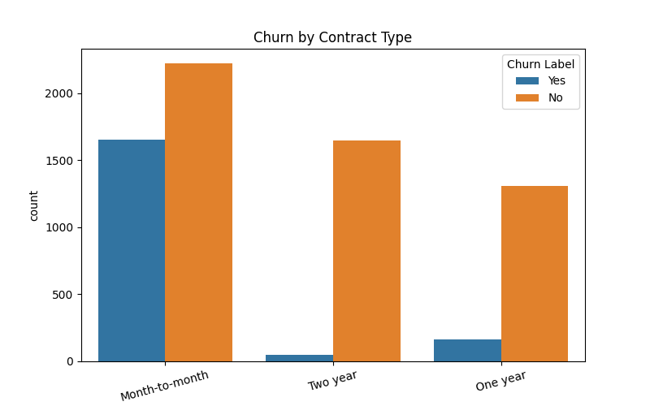
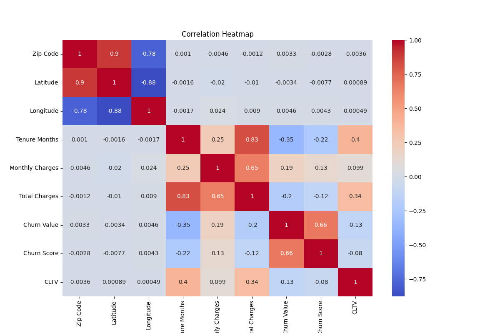
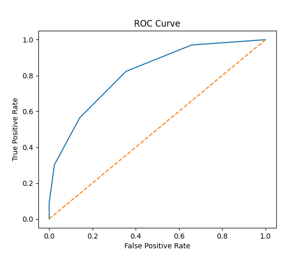
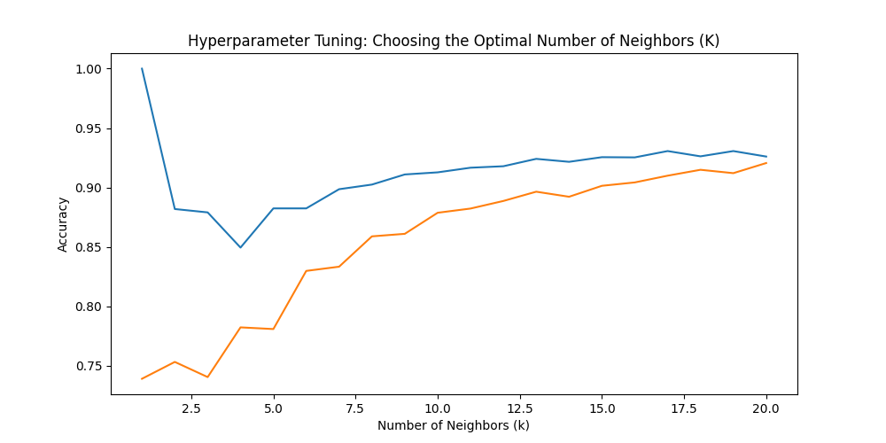

# 📊 Customer Churn Analysis and Prediction using Machine Learning


---

## 📌 Project Overview

Customer churn is one of the biggest challenges faced by telecom companies. Retaining an existing customer is significantly more cost-effective than acquiring a new one.

This project develops an **end-to-end Machine Learning solution** to predict whether a customer is likely to churn. It demonstrates the complete Scikit-learn workflow, including data preprocessing, exploratory data analysis, feature engineering, model building, evaluation, hyperparameter tuning, dimensionality reduction, clustering, regression, and model persistence.

---

## 🎯 Project Objectives

* Predict customer churn using Machine Learning.
* Perform Exploratory Data Analysis (EDA).
* Build and evaluate a K-Nearest Neighbors (KNN) classification model.
* Improve model performance using Cross Validation and GridSearchCV.
* Reduce dimensionality using Principal Component Analysis (PCA).
* Build reusable Machine Learning Pipelines.
* Segment customers using K-Means Clustering.
* Predict Customer Lifetime Value (CLTV) using Linear Regression.
* Save and reload trained models using Joblib.

---

## 📂 Dataset

**Dataset:** Telco Customer Churn Dataset

The dataset contains customer demographic information, account details, subscribed services, billing information, and churn status.

### Classification Target

* **Churn Label**

### Regression Target

* **CLTV (Customer Lifetime Value)**

---

## 🛠 Technologies Used

* Python
* Pandas
* NumPy
* Matplotlib
* Seaborn
* Scikit-learn
* Joblib
* OpenPyXL
* Jupyter Notebook

---

## 📁 Project Structure

```text
Customer-Churn-Prediction/
│
├── data/
│   └── Telco_customer_churn.xlsx
│
├── notebooks/
│   └── Customer_Churn_Analysis_and_Prediction.ipynb
│
├── models/
│   └── customer_churn_model.pkl
│
├── images/
│   ├── churn_distribution.png
│   ├── contract_vs_churn.png
│   ├── correlation_heatmap.png
│   ├── confusion_matrix.png
│   ├── roc_curve.png
│   ├── best_k.png
│   ├── elbow_method.png
│   └── customer_segments.png
│
├── requirements.txt
├── README.md
└── .gitignore
```

---

## 🔄 Machine Learning Workflow

```text
Load Dataset
      │
      ▼
Data Understanding
      │
      ▼
Data Cleaning
      │
      ▼
Exploratory Data Analysis (EDA)
      │
      ▼
Feature Engineering
      │
      ▼
Feature Encoding
      │
      ▼
Train-Test Split
      │
      ▼
Feature Scaling
      │
      ▼
KNN Classification
      │
      ▼
Model Evaluation
      │
      ▼
Cross Validation
      │
      ▼
Hyperparameter Tuning
      │
      ▼
Principal Component Analysis (PCA)
      │
      ▼
Machine Learning Pipeline
      │
      ▼
K-Means Clustering
      │
      ▼
Linear Regression (CLTV)
      │
      ▼
Model Persistence
      │
      ▼
Predict New Customer
```

---

## 🤖 Machine Learning Algorithms

### Classification

* K-Nearest Neighbors (KNN)

### Regression

* Linear Regression

### Clustering

* K-Means Clustering

### Dimensionality Reduction

* Principal Component Analysis (PCA)

### Hyperparameter Optimization

* GridSearchCV

---

## 📈 Model Performance

| Metric                       | Result     |
| ---------------------------- | ---------- |
| Best Classification Accuracy | **92.97%** |
| ROC-AUC Score                | **0.81**   |
| Cross Validation             | ✅          |
| Hyperparameter Tuning        | ✅          |
| Pipeline                     | ✅          |
| PCA                          | ✅          |

---

## 🏆 Results

- ✅ Achieved **92.97% classification accuracy** after hyperparameter tuning.
- ✅ Built an end-to-end machine learning pipeline using Scikit-learn.
- ✅ Performed feature engineering, one-hot encoding, and feature scaling.
- ✅ Applied Cross Validation and GridSearchCV for model optimization.
- ✅ Reduced dimensionality using Principal Component Analysis (PCA).
- ✅ Segmented customers into three groups using K-Means Clustering.
- ✅ Predicted Customer Lifetime Value (CLTV) using Linear Regression.
- ✅ Saved and reloaded the trained model using Joblib for future predictions.

---

## 📊 Project Visualizations

The following visualizations provide key insights into customer churn patterns and model performance.

### 1. Customer Churn Distribution

<p align="center">
  
</p>

Shows the distribution of customers who churned versus those who stayed.

---

### 2. Churn by Contract Type

<p align="center">
  
</p>

Illustrates how different contract types influence customer churn.

---

### 3. Correlation Heatmap

<p align="center">
  
</p>

Displays the correlation between numerical features to identify important relationships.

---

### 4. ROC Curve

<p align="center">
  
</p>

Evaluates the classification model's ability to distinguish between churned and non-churned customers.

---

### 5. Hyperparameter Tuning (Best K)

<p align="center">
  
</p>

Shows how different values of **K** affect the KNN classifier's performance, helping identify the optimal number of neighbors.

---

## ✨ Features Implemented

* Data Cleaning
* Missing Value Handling
* Feature Engineering
* One-Hot Encoding
* Standard Scaling
* Train-Test Split
* KNN Classification
* Model Evaluation
* Confusion Matrix
* Classification Report
* ROC Curve
* Cross Validation
* Hyperparameter Tuning
* Principal Component Analysis (PCA)
* Machine Learning Pipeline
* Customer Segmentation (K-Means)
* Linear Regression
* Model Persistence using Joblib
* Predicting New Customer Churn

---

## 💡 Business Insights

* Customers with month-to-month contracts are more likely to churn.
* Customers with higher monthly charges tend to have higher churn rates.
* Hyperparameter tuning improved model accuracy from **77.64%** to **92.97%**.
* PCA reduced dimensionality while preserving most of the dataset's information.
* K-Means clustering successfully segmented customers into three meaningful groups, enabling personalized marketing, improved customer retention, and better business decision-making.

---

## 🚀 How to Run the Project

### Clone the repository

```bash
git clone https://github.com/<your-username>/Customer-Churn-Prediction.git
```

### Navigate to the project folder

```bash
cd Customer-Churn-Prediction
```

### Install the required libraries

```bash
pip install -r requirements.txt
```

### Launch Jupyter Notebook

```bash
jupyter notebook
```

Open:

```
Customer_Churn_Analysis_and_Prediction.ipynb
```

---

## 🔮 Future Improvements

* Implement Random Forest and XGBoost for performance comparison.
* Deploy the model using Streamlit or Flask.
* Perform advanced feature selection.
* Explore additional clustering algorithms such as DBSCAN and Agglomerative Clustering.
* Build a real-time churn prediction dashboard.

---

## 👩‍💻 Author

**Sudhishna Mallavarapu**

This project was developed as part of my Machine Learning learning journey and internship preparation using **Scikit-learn**.

---

⭐ If you found this project useful, consider giving it a **Star** on GitHub! Thankyou!
